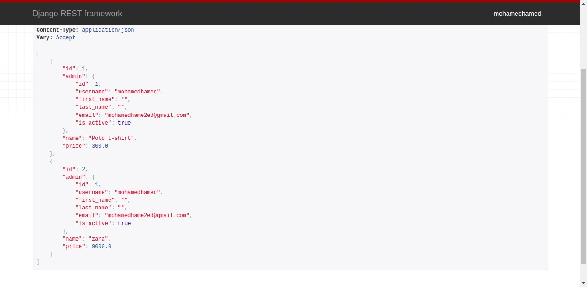

# eccomere-api

mapping data base

create apis 

UsetAuth [sign up , sign in]

eccomere   [Product , cart , order  ] models

and  convert database to Apis get and post 
and create views to disply this data 

i used MySql 

and test code by pytest

requirements run django 
  
pip install django-cors-headers

pip install Pillow

pip install djangorestframework

pip install -U pytest

pip install flake8

and 

python manage.py runserver
